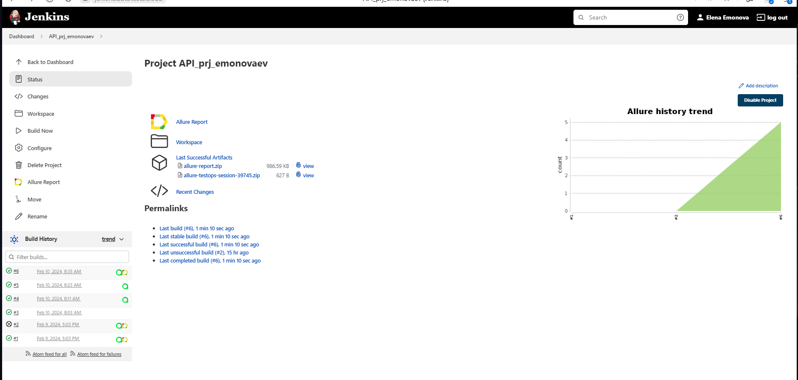
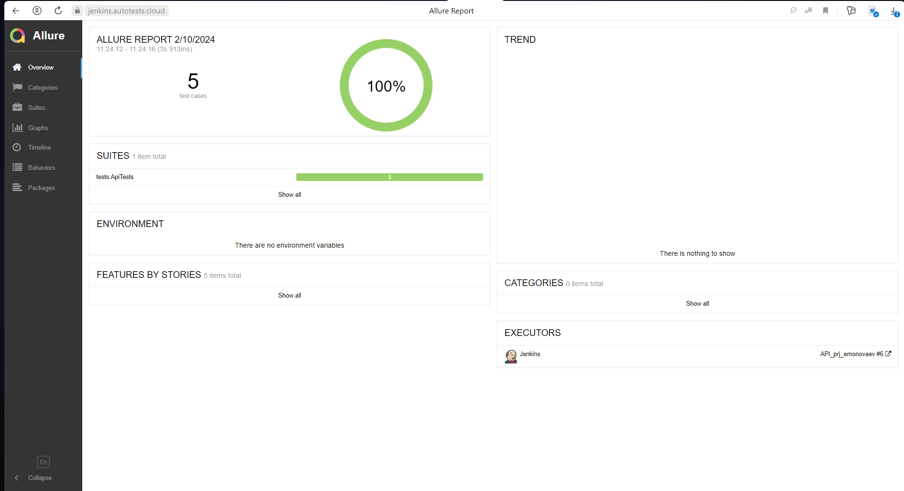
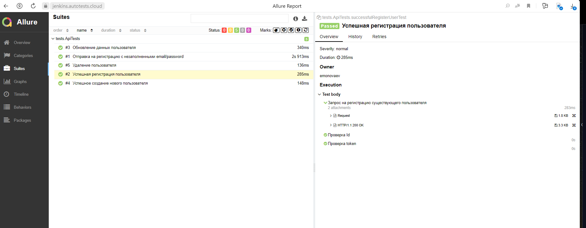
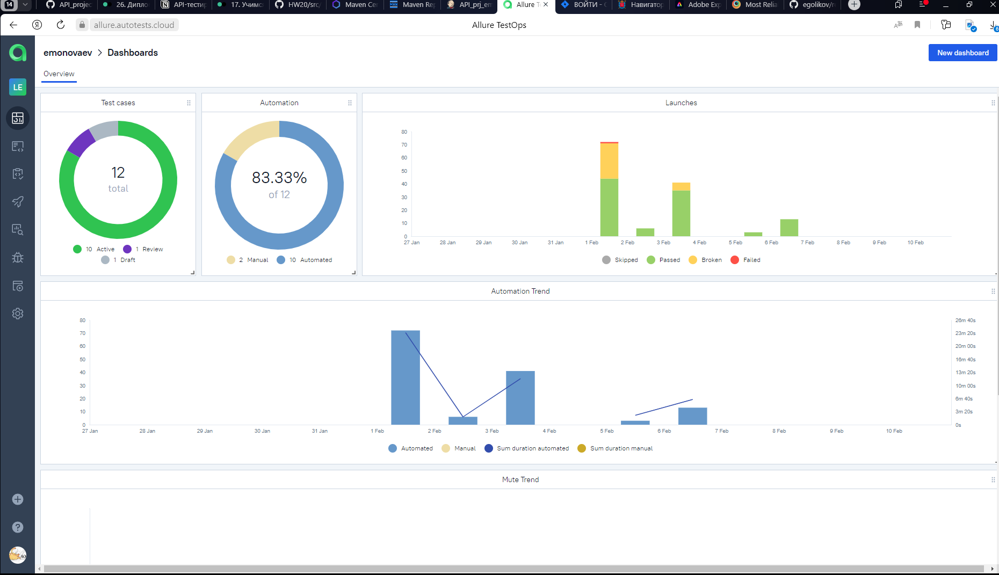
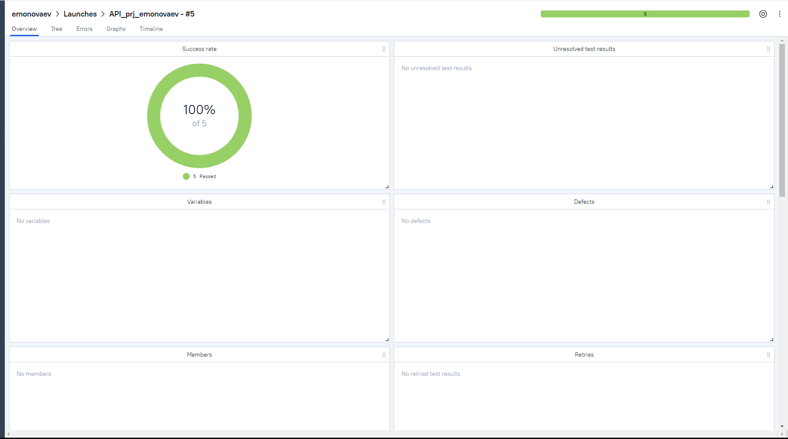
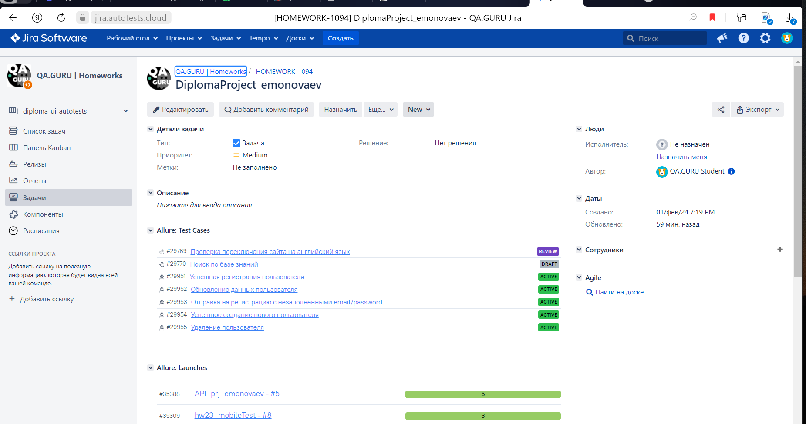
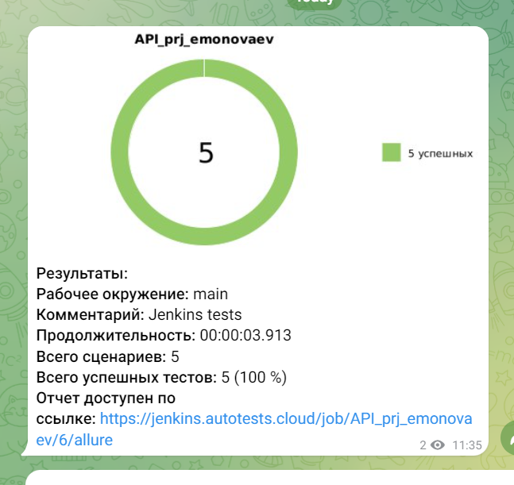

<h1 >Проект по автоматизации API тестирования сервиса <a href="https://reqres.in/ ">Reqres.in</a></h1>

<p align="center">  
</a>  
</p>

# 🧾 Содержание:

- [Технологии и инструменты](#технологии-и-инструменты)
- [Реализованные проверки](#Реализованные-проверки)
- [Запуск тестов (Сборка в Jenkins и параметры)](#запуск-тестов-сборка-в-jenkins)
- [Запуск тестов (Из терминала)](#запуск-тестов-из-терминала)
- [Интеграция с Allure Report](#allure-report)
- [Интеграция с Allure TestOps](#интеграция-с-allure-testops)
- [Интеграция с Jira](#интеграция-с-jira)
- [Уведомление в Telegram о результатах выполнения автоматизированных тестов](#уведомление-в-telegram-о-результатах-выполнения-автоматизированных-тестов)

<a id="технологии-и-инструменты"></a>

## 🔨 Технологии и инструменты:
 <a href="https://www.java.com/"></a>  <a href="https://www.jetbrains.com/idea/"></a>  <a href="https://github.com/"></a>  <a href="https://junit.org/junit5/"></a>  <a href="https://gradle.org/"></a>  <a href="https://github.com/allure-framework"></a>  <a href="https://allure.autotests.cloud/"></a>  <a href="https://www.jenkins.io/"></a>  <a href="https://www.atlassian.com/software/jira/"></a>  <a href="https://web.telegram.org/"></a>   <a href="https://rest-assured.io/"></a> 

В данном проекте автотесты написаны на **Java**. Для сборки проекта в
среде IntelliJ IDEA используется **Gradle**. **JUnit 5** задействован в качестве фреймворка модульного тестирования, а
**RestAssured** используется для тестирования API.
Запуск тестов выполняется из **Jenkins**, и вся работа по управлению проектом и отслеживанию задач выполняется с
использованием **Jira**. **Allure Report**, **AllureTestOps** и **Telegram Bot** используются для визуализации
результатов тестирования.

<a id="Реализованные-проверки"></a>

## 🏁 Реализованные проверки:

- Успешное создание нового пользователя
- Успешная регистрация пользователя
- Отправка на регистрацию с незаполненными email/password
- Обновление данных пользователя
- Удаление пользователя


<a id="запуск-тестов-сборка-в-jenkins"></a>

##  Сборка в [Jenkins](https://jenkins.autotests.cloud/job/API_prj_emonovaev/)

<p align="center">  
</a>  
</p>

<a id="запуск-тестов-из-терминала"></a>

## 🚀 Команда для запуска автотестов из терминала

```bash  
gradle clean test 
```

<a id="allure-report"></a>

##  </a>Интеграция с <a target="_blank" href="https://jenkins.autotests.cloud/job/API_prj_emonovaev/6/allure/#">Allure Report</a>

- Основная страница отчёта
<p align="center">  
  
</p>  

- Тест-кейсы

<p align="center">  
   
</p>

##  </a>Интеграция с <a target="_blank" href="https://allure.autotests.cloud">Allure TestOps</a>

- Основная страница отчёта

<p align="center">  
  
</p>  

- Страница запуска
  
<p align="center">  
  
</p

<a id="#интеграция-с-jira"></a>
## </a> Интеграция с <a target="_blank" href="https://jira.autotests.cloud/browse/HOMEWORK-1094">Jira</a>

<p align="center">  
  
</p>

____

<a id="уведомление-в-telegram-о-результатах-выполнения-автоматизированных-тестов"></a>

## </a> Уведомление в Telegram при помощи бота

____
<p align="center">  
  
</p>

____
